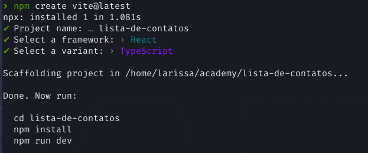
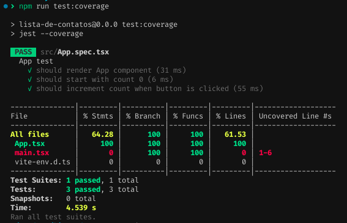

# Iniciando um projeto React

## Bundlers e Compilers

Antes de começarmos a falar sobre React, precisamos entender alguns conceitos que são importantes para o desenvolvimento de aplicações React. ECMA Script, que é o padrão para a linguagem base do Javascript, possui diversas versões, como o ES5, ES6, ES7, etc. Cada versão possui novas funcionalidades e melhorias, porém nem todos os navegadores suportam todas as versões ([site](https://caniuse.com/) para nos ajudar a saber as compatibilidades). Por isso, precisamos de ferramentas que transformem nosso código para que ele possa ser executado em todos os navegadores. São ferramentas cruciais que desempenham um papel importante na transformação, otimização e compatibilização do código fonte escrito pelos desenvolvedores para que ele possa ser executado.

### Compilar

Traduzir o código-fonte de uma linguagem de programação para outra linguagem, normalmente de uma linguagem de alto nível para uma linguagem de baixo nível.

### Transpilar

É similar a compilar, porém ele não traduz o código-fonte de uma linguagem de programação para uma linguagem de baixo nível, mas sim para outra linguagem de programação do mesmo nível. Por exemplo, o TypeScript é uma linguagem de programação de alto nível que é transpilada para JavaScript, que também é uma linguagem de programação de alto nível.

### Bundlers

Ferramenta que agrupa e combina vários arquivos JavaScript e seus recursos relacionados em um único arquivo (ou em alguns poucos arquivos) para serem usados em um aplicativo web. Essa abordagem é conhecida como "empacotamento" ou "bundling". Assim, ele organizam e gerenciam as dependências do projeto, permitindo que você use e importe módulos JavaScript de terceiros como se fossem módulos locais instalados no projeto.

Os bundlers também podem realizar outras tarefas, como transpilação de código (conversão de código de uma versão de JavaScript para outra, por exemplo, ES6+ para ES5), otimização de código, minificação (redução do tamanho do código removendo espaços em branco e comentários), e até mesmo suporte a recursos como CSS, imagens e fontes, incorporando-os no bundle final.

No mundo do JavaScript, os bundlers mais conhecidos são o [Webpack](https://webpack.js.org/), [Babel](https://babeljs.io/), [Vite](https://vitejs.dev/), [Snowpack](https://www.snowpack.dev/), entre outros.

## Criando um projeto React

Por muito tempo o React foi criado com o famoso boilerplate `create-react-app`, ou seja, um pacote que cria um projeto inicial com várias configurações já predefinidas. Porém, nesse ano de 2023, o pessoal responsável pelo projeto lançou uma nova documentação que já não recomenda mais o uso do `create-react-app` e sim o uso de outros frameworks do React como o `Next.js`, `Remix` `Gatsby`. Você pode conferir [aqui](https://react.dev/learn/start-a-new-react-project).

Esses frameworks são mais completos e possuem mais funcionalidades que o antigo `create-react-app`, pois já nos trazem uma estrutura bem maior pronta para o desenvolvimento de uma aplicação React. Além disso, eles já possuem configurações de rotas, de estilização, de testes, de deploy, entre outras coisas.

Acredito que tudo isso é React e que pra utiliza-lo juntamente com esses frameworks, você precisa saber React. Por isso, vamos focar no React de forma mais simples utilizando o [Vite](https://vitejs.dev/guide/) que é um bundler que nos permite criar diversos tipos de projetos, como projetos React, Vue, Svelte, etc.

Lembrando que precisamos ter o node instalado pelo menos na versão 16. Podemos usar os principais gerenciadores de pacotes da atualidade, como o `npm`, `yarn` e o `pnpm`. Nesse exemplo, vamos utilizar o `npm` para criar nosso projeto React, mas fique a vontade para usar o de sua preferência.

Para criar um projeto React com o Vite, basta executar o seguinte comando:

```bash
npm create vite@latest
```

Ele deverá te retornar uma série se perguntas, nessa ordem:

1. Project name: `lista-de-contatos`
2. Select a framework: `React`
3. Select a variant: `TypeScript`

Agora deverá com `Done. Now run:` pedindo para executar os seguintes comandos descritos abaixo:

```bash
# Entrar na pasta do projeto criado
cd lista-de-contatos

# Instalar as dependências
npm install

# Rodar o projeto em modo de desenvolvimento
npm run dev
```



Pronto! Agora você já tem um projeto React criado com o Vite que deverá estar rodando seu `localhost`, a porta deverá ser informada no terminal. Ao alterar algum arquivo, o Vite irá recarregar a página automaticamente, pois o vite já traz esse comportamento de _hot reload_ para nós.

## Estrutura do projeto

Se você abrir o arquivo `package.json`, verá que ele já possui algumas dependências instaladas, como o `react` e o `react-dom`, além de outras dependências de desenvolvimento, como o `eslint`, `vite`, `typescript`.

Já possui alguns scripts configurados:

- `dev`: roda o projeto em modo de desenvolvimento
- `build`: gera o build do projeto
- `lint`: roda o linter
- `preview`: roda o projeto em modo de produção

Na raiz do projeto, podemos notar alguns outros arquivos:

- `index.html`: arquivo HTML que será renderizado pelo React. Nele se encontra a div com o id `root` que será o ponto de entrada da nossa aplicação React.
- `.eslintrc.js`: arquivo de configuração do linter.
- `.gitignore`: arquivo que contém os arquivos que não serão enviados para o repositório.
- `README.md`: arquivo de documentação do projeto.
- `tsconfig.json`: arquivo de configuração do TypeScript.
- `tsconfig.node.json`: arquivo de configuração do TypeScript para o Node.
- `vite.config.ts`: arquivo de configuração do Vite.

Já as pastas são:

- `node_modules`: pasta que contém as dependências do projeto.
- `public`: pasta que contém os arquivos públicos do projeto, onde normalmente colocamos favicon, imagens, etc.
- `src`: pasta que contém os arquivos do projeto, nela que iremos trabalhar colocando nosso código.
  - `assets`: pasta que contém os arquivos estáticos do projeto, como imagens, fontes, etc.
  - `main.tsx`: arquivo que contém o ponto de entrada da aplicação, nele nós importamos o React e o ReactDOM e renderizamos o componente principal da aplicação. Aqui também é onde importamos o componente App, envolto de um [StrictMode](https://react.dev/reference/react/StrictMode) que é um componente do React que nos ajuda a encontrar problemas na aplicação.
  - `App.tsx`: arquivo que contém o componente principal da aplicação.
  - `App.css`: arquivo que contém o estilo do componente principal da aplicação.
  - `index.css`: arquivo que contém o estilo global da aplicação.

Os projetos em React possuem uma estrutura bem simples, mas que pode ser modificada de acordo com a necessidade do projeto. Por exemplo, podemos criar dentro do `src` uma pasta `components` para colocar os componentes da aplicação, uma pasta `pages` para colocar as páginas da aplicação, etc.

Seria bom também adicionar um arquivo pro eslint ignorar algumas pastas. Para isso, crie um arquivo `.eslintignore` na raiz do projeto com o seguinte conteúdo:

```
node_modules/
dist/
env.d.ts
```

### Adicionando Prettier

Para a base do nosso projeto ainda podemos melhorar um pouco mais, adicionando o `prettier` para melhorar a formatação do código com o seguinte comando:

```bash
npm install --save-dev --save-exact prettier
```

E criando um arquivo `.prettierrc` na raiz do projeto com o seguinte conteúdo:

```json
{
  "semi": true,
  "singleQuote": true,
  "trailingComma": "none",
  "arrowParens": "avoid"
}
```

Vamos adicionar também o `eslint-plugin-prettier` para que o linter possa entender o `prettier` e não acusar erros de formatação no código. Para isso, execute o seguinte comando:

```bash
npm install --save-dev eslint-config-prettier
```

E adicione a seguinte configuração no arquivo `.eslintrc`:

```js
module.exports = {
  // ...
  extends: [
    // ...
    'eslint-config-prettier'
  ]
  // ...
};
```

Por fim, vamos adicionar um script no `package.json` para que o `prettier` possa formatar nosso código dentro do `src`. Adicione o seguinte script:

```json
{
  "scripts": {
    // ...
    "format": "prettier --write \"src/**/*.{ts,tsx}\""
  }
}
```

Para o prettier ignorar algumas pastas, crie um arquivo `.prettierignore` na raiz do projeto com o seguinte conteúdo:

```
node_modules/
dist/
```

### Adicionando ambiente de testes

Para testar nosso código, vamos utilizar o [Jest](https://jestjs.io/) que é um framework de testes muito utilizado no mercado e também usaremos [React Testing Library](https://testing-library.com/) que é uma biblioteca que nos ajuda a testar componentes React.

Caso seu projeto não vá utilizar testes, você pode pular essa parte.

#### Jest

Para começar, execute o seguinte comando:

```bash
npm install --save-dev jest @types/jest
```

#### React Testing Library

Para instalar o React Testing Library, execute o seguinte comando:

```bash
npm install --save-dev @testing-library/react @testing-library/jest-dom @testing-library/user-event
```

Para que o Jest entenda o React Testing Library, precisamos adicionar algumas configurações e libs adicionais. Para isso, digite:

```bash
npm install --save-dev @babel/core @babel/preset-env @babel/preset-react babel-jest identity-obj-proxy jest-svg-transformer jest-transform-css jest-environment-jsdom @babel/preset-typescript ts-jest
```

### Configurando o Jest

Crie um arquivo na raiz do projeto chamado `jest.config.cjs` com o seguinte conteúdo:

```cjs
module.exports = {
  testEnvironment: 'jest-environment-jsdom',
  testMatch: ['**/__tests__/**/*.ts?(x)', '**/?(*.)+(spec|test).ts?(x)'],
  testPathIgnorePatterns: ['/node_modules/', '/dist/'],
  setupFilesAfterEnv: ['<rootDir>/setup-test.js'],
  transformIgnorePatterns: ['<rootDir>/node_modules/'],
  preset: 'ts-jest',
  transform: {
    '^.+\\.(ts|tsx)?$': 'ts-jest',
    '^.+\\.(js|jsx)$': 'babel-jest'
  },
  moduleNameMapper: {
    '^.+\\.svg$': 'jest-svg-transformer',
    '\\.(css|less|scss)$': 'identity-obj-proxy'
  },
  collectCoverageFrom: ['<rootDir>/src/**/*.{js,jsx,ts,tsx}']
};
```

Crie também um arquivo na raiz do projeto chamado `setup-test.js` com o seguinte conteúdo:

```js
import '@testing-library/jest-dom';
```

Para a configuração do Babel, crie um arquivo na raiz do projeto chamado `babel.config.cjs` com o seguinte conteúdo:

```js
module.exports = {
  presets: [
    ['@babel/preset-env', { targets: { esmodules: 'true' } }],
    ['@babel/preset-react', { runtime: 'automatic' }],
    '@babel/preset-typescript'
  ]
};
```

Adicione a seguinte linha no arquivo `tsconfig.json`:

```json
{
  "compilerOptions": {
    // ...
    "esModuleInterop": true
  }
}
```

E por último para poder usar os comandos de testes, no `package.json` adicione os seguintes scripts:

```json
{
  "scripts": {
    // ...
    "test": "jest",
    "test:watch": "jest --watchAll",
    "test:coverage": "jest --coverage"
  }
}
```

O modo `coverage` irá gerar um relatório de cobertura de testes, mostrando quais arquivos foram testados e quais não foram. É uma boa prática sempre rodar esse comando para saber se está faltando algum arquivo para ser testado. Lembrando que é preciso adicionar ao `.gitignore` a pasta `coverage` para que ela não seja enviada para o repositório.

Agora para testar se está tudo conforme esperamos, vamos criar um arquivo de testes para o componente `App.tsx`. Crie um arquivo `App.spec.tsx` ou `App.test.tsx` com o seguinte conteúdo:

```tsx
import { fireEvent, render, screen } from '@testing-library/react';
import App from './App';

describe('App test', () => {
  it('should render App component', () => {
    render(<App />);
    expect(screen.getByText('Vite + React')).toBeInTheDocument();
  });

  it('should start with count 0', () => {
    render(<App />);
    expect(screen.getByText('count is 0')).toBeInTheDocument();
  });

  it('should increment count when button is clicked', () => {
    render(<App />);
    const button = screen.getByRole('button');
    fireEvent.click(button);
    expect(screen.getByText('count is 1')).toBeInTheDocument();
    fireEvent.click(button);
    expect(screen.getByText('count is 2')).toBeInTheDocument();
  });
});
```

Rode o comando `npm run test` e veja se os testes passam. Se tudo estiver certo, você deverá ver algo assim:


E para checar a cobertura de testes, rode o comando `npm run test:coverage` e veja se está tudo certo.



## Links e dicas

- **VS Code**
  - [Jest Runner](https://marketplace.visualstudio.com/items?itemName=firsttris.vscode-jest-runner)
